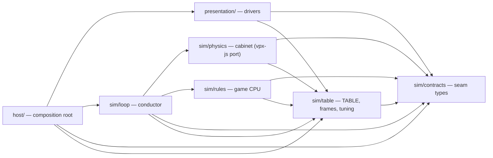
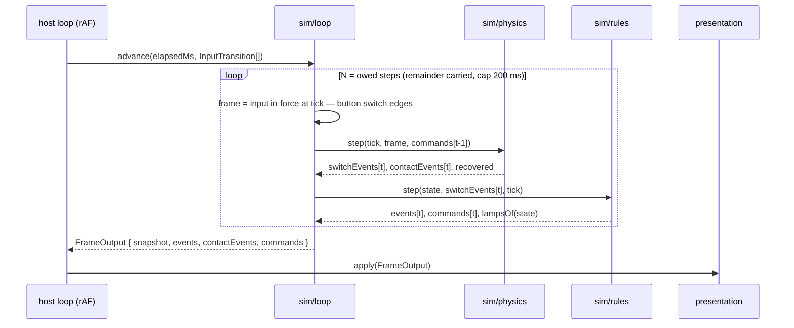
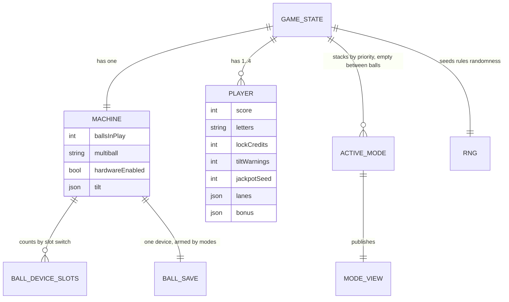
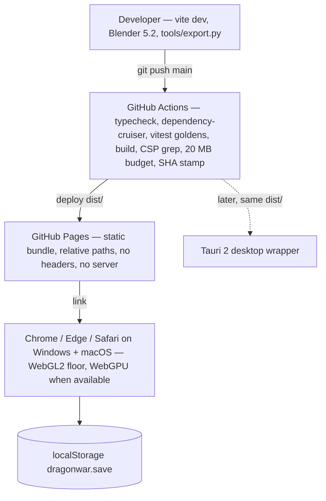

# Architecture Spine — DragonWar

## Design Paradigm

**Ports-and-adapters around a virtual pinball machine.** The Rules layer is the game CPU — the domain core, a pure function of cabinet and playfield switches. The Physics core is the cabinet: a driving-and-driven adapter behind a virtual I/O board (switches in, coils out). Presentation is the set of output drivers — lamps, flashers, GI, display, mechanisms, audio, camera. The Host is the composition root: boot, the frame loop, input, persistence, the dev panel. Everything in `sim/` runs on one fixed-step clock and knows nothing about the DOM, Babylon, or wall-clock time.

| Layer | Directory | Role |
| --- | --- | --- |
| Contracts | `src/sim/contracts/` | The closed unions every seam speaks (see *Seam Contracts*) |
| Table | `src/sim/table/` | The device registry (`TABLE`), frames and units, tunables |
| Physics (cabinet) | `src/sim/physics/` | vpx-js port; ball and flipper bodies, hardware rules, devices, cabinet oscillator, tilt bob, slam detector |
| Rules (game CPU) | `src/sim/rules/` | devices-and-shots layer, ball controller, players, modes, scoring |
| Loop | `src/sim/loop/` | Fixed-step conductor, cabinet-switch source, replay recorder and player |
| Presentation (drivers) | `src/presentation/` | scene, mechanisms, lighting, backglass, audio, camera |
| Host | `src/host/` | boot, rAF driver, input, persistence, settings, dev tuning panel |



Arrows are the only permitted import directions. `rules` and `physics` never import each other; `host` never imports `physics` or `rules` directly; nothing in `sim/` imports `presentation/`, `host/`, `@babylonjs/*`, or DOM globals.

## Invariants & Rules

`[ADOPTED]` marks a decision already settled by the PRD, brief, research, or verified reality; untagged decisions were made in this run. Time values in rules are named `…Ms` when authored and `…Ticks` once converted (AD-3).

### AD-1 — Virtual-machine ports-and-adapters with fixed dependency direction `[ADOPTED]`

- **Binds:** all
- **Prevents:** rules reaching into physics for a shortcut; presentation mutating sim state; the simulation becoming un-testable without a browser; the registry growing into a table-loading engine
- **Rule:** The dependency graph above is the law. `sim/**` is DOM-free and Babylon-free. Presentation reads `FrameOutput` and never calls into physics or rules. Host composes; it owns no game logic. **One table:** `sim/table/dragonwar.ts` is imported directly wherever a device is named; there is no `Table` interface, no table-loading API, no runtime table selection, no plugin or registration API.

### AD-2 — Switches are edges from one source per class; contacts and actuations go to presentation only `[ADOPTED]`

- **Binds:** FR-7, FR-11, FR-14, FR-46, NFR-5; `sim/physics`, `sim/loop`, `sim/rules/devices`, `presentation/audio`
- **Prevents:** ball velocity or position leaking into rules; two debounces stacked (or none); a rollover closing forty times per pass; flipper snap played from the key state during Tilt; switch semantics re-derived in presentation
- **Rule:** Physics emits **playfield and cabinet-mechanism** `SwitchEvent`s (`s_tilt_bob`, `s_slam_tilt` included) as edges only — one `closed: true` when a zone test transitions outside→inside, one `closed: false` on the reverse — with per-switch hysteresis and `settleTicks` from `TABLE.switches` (defaults by class: rollover 0, standup target 8, drop target 20, bumper skirt 2, tilt bob 0). `sim/loop` emits only the **button** switches (`s_start`, `s_flipper_l`, `s_flipper_r`, `s_plunger`) from `InputFrame` transitions. Rules never debounce a switch; the only rules-side windows are semantic (`tiltWarningSpacingMs`, `tiltSettleMs`). Physics emits `ContactEvent`s to presentation only: ball contacts (with `speed`, `surface`, `pos`) **and** actuations (`coil_fire`, `flipper_eos`, `drop_target_down`, `bank_reset`, `eject`, `spinner_tick`) so every mechanical sound has exactly one source. Rules never receive a `ContactEvent`; presentation never reads `InputFrame` and never derives game state from contacts.

### AD-3 — One simulation clock behind one constant; no wall-clock and no unseeded randomness inside `sim/`

- **Binds:** FR-8, FR-14, FR-19, FR-20, FR-22, FR-23, FR-24, FR-33, FR-34, NFR-2, NFR-5; `sim/**`
- **Prevents:** a ball-save timer on `performance.now()` while a hurry-up counts ticks; an unreplayable game; Match from `Math.random()`; a scatter draw inside the port silently breaking replays; a 480 Hz fallback that rewrites every timer
- **Rule:** `TICK_HZ` is one constant in `sim/contracts/time.ts`, set from the port's `PHYSICS_STEPTIME` (1000 µs → 1000 Hz); if spike 1 forces 480 Hz, that constant changes and golden replays are re-recorded — nothing else in `sim/` may contain a literal millisecond. `tick` (uint32, reset at game start) is the only time inside `sim/`. Every rules timer — ball save, grace, hurry-up, ball search, tilt spacing and settle, mode timers, and every display-paced sequence (bonus count-down, Match reveal, mode-select window, initials-entry timeout) — is authored in ms in `tuning.ts`, converted to ticks once at load, and drives presentation by emitting step events; presentation animates to them and never reports completion. All rules randomness (Match, skill-shot lane) draws from a seeded PRNG in `GameState.rng`. Physics has no randomness: scatter is 0 on every material by default; if ever enabled it draws from a second seeded PRNG in physics state. Both seeds are in the replay header.

### AD-4 — Loop contract: tick-stamped input, rules after every physics step, commands next tick, remainder carried, 200 ms cap

- **Binds:** FR-5, FR-7, NFR-1, NFR-2, NFR-3, NFR-5; `sim/loop`, `host/loop`, `host/input`
- **Prevents:** a key press landing on a different tick at 30 Hz than at 120 Hz; a light tap lost inside one frame; 4 % slow motion from a dropped remainder; a stalled tab freezing or fast-forwarding the game; a cue double-fired on a frame that owed zero steps
- **Rule:** The host stamps every key transition with the sim tick derived from the DOM event `timeStamp` against the accumulator origin and hands `advance(elapsedMs, transitions: InputTransition[])` an ordered list; the loop applies the `InputFrame` in force at each tick, and physics derives edges per tick from consecutive frames. Key codes never enter `sim/` — the key→action map lives only in `host/input`. The accumulator owes `elapsed × TICK_HZ` steps and **carries the fractional remainder**; owed time beyond 200 ms is discarded and `sim_time_discarded { ms }` is the first event of that frame. For each step: physics consumes the frame and the commands issued at the previous tick and emits events; then `rules.step(state, switchEvents, tick)` runs — every step, even with none. Inside a step the time-of-impact loop is bounded by forced advance (`STATICTIME`, a solver constant) so a step always terminates deterministically. `FrameOutput` carries every event and command from all N steps in tick order (N = 0 → empty arrays, unchanged snapshot); presentation renders the latest snapshot without interpolation, treats lamp and GI commands as latest-wins per target, and treats every show, flasher, contact and semantic event as a discrete occurrence scheduled by its tick offset within the frame — rate-limited by the driver, never dropped by the host. A replay is `ReplayHeader + InputTransition[]` and must reproduce the state hash.



### AD-5 — Hardware rules live in physics, gated by coil enable; the flipper is the ported mover; nudge coupling is re-derived `[ADOPTED]`

- **Binds:** FR-5, FR-13, FR-15, FR-16, FR-18, FR-25, FR-31, NFR-3; `sim/physics`, `sim/rules`, `host/input`
- **Prevents:** a flipper or slingshot kick routed through the rules tick; a hybrid coil model derived on top of the port; two owners of flipper state; nudge as a force on the ball; slam tilt sharing the bob's threshold or living outside the replay
- **Rule:** Flippers, the manual plunger, slingshots and pop bumpers are **hardware rules** inside the physics step — switch or button → coil on the same tick — each behind its coil (`c_flipper_l`, `c_flipper_r`, `c_sling_l`, `c_sling_r`, `c_pop_*`) and gated only by `CoilCommand enable | disable`; Tilt, game over and Attract disable all of them together. The flipper solenoid is vpx-js's `FlipperMover` ported verbatim — strength, ramp-up, end-of-stroke torque and angle, return strength, inertia ⅓·m·r² — and MPF's pulse/hold figures are calibration references, never parameters. The manual plunge maps `s_plunger` hold ticks through `plungerSpeedByHoldMs` in `tuning.ts`. Button edges surface to rules as cabinet switches for lane change, mode selection and initials. Nudge is an impulse to the cabinet oscillator; the oscillator is ported, but the **ball coupling is re-derived as table-frame motion** (the ball keeps its inertia while the cabinet moves — VPX's nudge-as-ball-force is a known open defect) and pinned by a golden replay. The tilt bob is a pendulum whose closure is `s_tilt_bob`. The slam detector is a tick-windowed nudge count in physics beside the oscillator, threshold `slamNudgesPerWindow` in `tuning.ts`, closure `s_slam_tilt` — this resolves PRD OQ-4.

### AD-6 — Physics owns ball bodies and mechanical state; rules own ball accounting; devices park and eject only on command `[ADOPTED]`

- **Binds:** FR-17, FR-18, FR-19, FR-23, FR-28, FR-29, FR-31, FR-35, FR-37, FR-38, FR-40, UJ-3; `sim/physics/devices`, `sim/rules/ball-controller`
- **Prevents:** two owners of "where is ball 2"; the Lock deciding to eject; a parked ball that a spring plunger cannot strike; a device whose count drifts on a double drain; Quick multiball silently starving in Hot seat; a stuck ball that no protocol can recover
- **Rule:** The machine carries **4 balls**, asserted at boot. `bd_trough` (capacity 4, slots `s_trough_1..4`, eject `c_trough_eject`) and `bd_lock` (capacity 3 — two held plus one staging — slots `s_lock_1..3`, eject `c_mouth`) are **parking** devices: physics parks an entering ball unconditionally into the lowest empty slot, removes it from the simulated set and closes that slot's switch; on `pulse` of the eject coil it spawns the ball from the highest filled slot at the device's authored eject pose and speed and opens the switch — the Lock's pose *is* the Mouth, aimed at the flippers, one ball per pulse. `bd_shooter` (the plunger lane) is a **non-parking** mechanical-eject device: the served ball stays simulated resting on the plunger tip, entry switch `s_shooter_lane`, two exits — the manual plunge (AD-5) or `pulse c_autolaunch`. **The opening of `s_shooter_lane` is the one event that means "plunged"** — the devices layer (AD-19) emits it as `ball_launched`, on which the ball controller increments `ballsInPlay`, starts the ball-save timer and arms the skill shot (which closes on the next playfield closure that is not a Top lane). Device counts in `GameState` are the number of closed slot switches and nothing else; rules enforce capacity and answer a slot beyond it (`device_overflow`) with an immediate eject. Drop targets (`s_dragon_[d,r,a,g,o,n]`) and the spinner keep mechanical state in physics — a dropped target is non-collidable until `pulse c_dragon_bank_reset` raises the bank; the spinner spins from ball contact and closes `s_spinner` once per revolution until it decays — while letters and counts live only in rules. Ball search is a rules protocol of tick-timed pulses in `TABLE.ballDevices[*].ballSearchOrder`; its final stage issues `RecoverCommand`, the one command that lets physics despawn every ball outside a device; physics returns the `recovered` count from `step()` and the ball controller emits `ball_missing { count }`.

### AD-7 — `GameState` is one plain-data tree with fixed ownership scopes

- **Binds:** FR-17, FR-20, FR-25, FR-28, FR-37, FR-39, FR-41, FR-51, UJ-3; `sim/rules`, `sim/contracts`
- **Prevents:** per-player facts on the machine and machine facts on a player; a Joust running into the next player's ball; a lit lane lost when the skill-shot mode stops; state that cannot be snapshotted, hashed, or replayed
- **Rule:** `GameState = { tick, phase, machine, players[], currentPlayer, modes[], rng }`, JSON-serializable, no class instances or closures, mutated only inside `rules.step`. **Player-scoped** (only under `players[i]`): score, DRAGON letters, Lock credits, modes played, tilt warnings, bonus by category and multiplier, extra balls, lanes (lit flags and completed sets, owned by the base mode; the skill-shot mode writes the lit Top lane once on `ball_starting` from `rng` and never again), Jackpot seed and Wars started. **Machine-scoped** (only under `machine`): device slot states and `ballsInPlay`, `hardwareEnabled`, `ballSave`, `tilt`, `multiball` (`null` | `'quickmb'` | `'war'`), `highscores` (read-only, from `GameStart`). **Mode-local** (only under `modes[i]`): the mode's own timers and counters, published to presentation only as its typed `ModeView`. `modes[]` is empty between balls: every active mode receives `_will_stop` before `ball_ended`; `ball_will_start` resets `ballSave`, `tilt` and `multiball`; `ball_starting` enables hardware. The bob is never reset by command — its physical decay plus `tiltSettleMs` is the settle.



### AD-8 — Modes stack by unique numeric priority and speak the four-phase event convention `[ADOPTED]`

- **Binds:** FR-33..FR-41; `sim/rules/modes`
- **Prevents:** two modes both claiming the Backglass; a Hurry-up timer paused by a multiball; ad-hoc start/stop hooks; a mode parsing raw switches
- **Rule:** Priorities are unique — base 100, skill shot 200, Hurry-up 300, Joust 310, Quick multiball 400, War 500 — and a duplicate is a dev-mode assertion. Each active mode receives every device and shot event (AD-19), highest priority first; scoring accrues from all active modes; presentation priority is the highest active mode. A mode owns its internal timers and contributes lamp roles by priority to `lampsOf(state)` (AD-9); it never emits a `CoilCommand`. Start and stop go only through `mode_<name>_will_start / _starting / _started` and `_will_stop / _stopping / _stopped`.

### AD-9 — Closed command union; outputs address devices by name and semantic step; lamp state is a projection

- **Binds:** FR-3, FR-30, FR-42..FR-45, FR-48; `sim/rules`, `sim/loop`, `presentation/*`
- **Prevents:** RGB or blink cadence in rules; a mode "turning its lamps off"; display strings formatted in rules; a flasher left on; presentation joining a tick-*t* event to a tick-*t+N* snapshot; the Dragon animated from three different truths
- **Rule:** The rules→physics commands are `CoilCommand { coil, action: 'pulse' | 'enable' | 'disable' }` — a device eject is `pulse` on `TABLE.ballDevices[bd].ejectCoil`, resolved by the ball controller — and `RecoverCommand` (ball search only, AD-6). Rules→presentation commands are `LampCommand { lamp, role, step }`, `GiCommand { channel, level }`, `FlasherCommand { flasher, ms }` and `ShowCommand { show }`, nothing else. **Lamp state is a pure projection** `lampsOf(state): LampState` computed by rules every step (modes contribute roles by priority); `sim/loop` emits the diff as `LampCommand`s; `step ∈ {0 off, 1 lit, 2 emphasised, 3 urgent}` is the only progression rules may express — Jackpot ladder, ball-save hurry-up, Charge — and `presentation/lighting/grammar.ts` is the one `(role, step)` → RGB, intensity and cadence table, with blinking timed by presentation. `role ∈ { off, lit, hurryup, quickmb, joust, dragon, special }` — never a colour. `GiCommand.level` (0..1) is the only continuous level and also drives the architectural channels (`gi_backbox`, `gi_cabinet`, `gi_arch`), set once per phase. `FlasherCommand.ms` is the only wall-time duration, honoured by the flasher driver's duty-cycle limiter. `ShowCommand` addresses any named non-lamp effect in `TABLE.shows` — audio cues and mechanism animations alike (`show_dragon_mouth_open` is a show). Every semantic event is **payload-complete** (`ball_ended { player, bonusByCategory, multiplier, total, tilted }`, `war_strike { remaining, jackpot }`, `match_drawn { number, winners[] }`, …); presentation never joins an event to the snapshot. The snapshot is for continuous display only, and `ModeView` is the only shape of `modes[i]` presentation may read. Rules never format text.

### AD-10 — One canonical frame, three sanctioned conversions, geometry authored unpitched, reference dimensions asserted

- **Binds:** FR-4, FR-10, FR-29; `sim/table/frames.ts`, `sim/physics/loader`, `presentation/scene`, `assets/`
- **Prevents:** Blender Z-up, glTF Y-up, VPX y-down and Babylon's left-handed default meeting in four files; the ball rendered at the mirror of its collision position; pitch applied twice or nowhere; a ball or playfield the wrong size
- **Rule:** The **table frame** is playfield-local millimetres, right-handed: origin at the playfield's bottom-left corner nearest the player, X across to the right, Y up the playfield away from the player, Z normal to the playfield toward the glass. `TABLE.reference = { playfieldMm: { w: 514.4, h: 1066.8 }, ballMm: 26.99, pitchDeg: 6.5, flipperBatIn: 3.125 }` and the loader asserts the `col_playfield` bounds and flipper node lengths against it within tolerance. Geometry is authored **unpitched**; Pitch is applied by physics as the gravity vector (the VPX slope model) and by presentation as a rotation of `playfield_root` only, about `pivot_pitch`, by the effective pitch read from the snapshot each frame — never by tilting geometry. The **glb frame** is Blender's default glTF export with no added rotation: metres; glb +X = table +X; glb +Y = table +Z; glb −Z = table +Y. Physics keeps VP units internally (1 U = 0.53975 mm; ball radius 25 U; VPX y-down frame). `frames.ts` exports exactly three conversions — `glbToTable()` (used only by the loaders at load time), `toPhysics()`, `toScene()` — and no other file converts units or axes. The Babylon scene is created with `useRightHandedSystem = true`, so no `__root__` handedness flip exists and `toScene()` is mm→m plus the same permutation as `glbToTable⁻¹`.

### AD-11 — Blender owns placement and geometry; `TABLE` owns devices, wiring, groups and tunables; the export script is the contract's enforcer

- **Binds:** FR-4, FR-11, FR-26..FR-31, FR-43, OQ-5, OQ-6, §6.3; `assets/src`, `tools/export.py`, `sim/table`, `sim/physics/loader`, `presentation/scene`
- **Prevents:** flipper positions in TypeScript disagreeing with the mesh; a device with no switch; a light-group spelled two ways; a decorative mesh the ball hits; `sim/` parsing glb (and therefore needing Babylon in a headless test); a fast ball skipping a thin rollover; art blocking epic 1
- **Rule:** `assets/src/dragonwar.blend` is the sole owner of every position, mesh and switch zone. `src/sim/table/dragonwar.ts` exports `TABLE as const` — the sole registry of switches (with `settleTicks` class), coils, lamps (channel + group), flashers, ball devices (capacity, slot switches in fill order, eject coil, `ballSearchOrder`), shots, shows, `lightGroups`, `reference` — plus wiring and glb node names. `tools/export.py` runs every export with `export_yup` and `export_extras` on, validates node names (`^[a-z][a-z0-9_]*$`, unique across all glbs, one material each) and every `lightgroup`, `surface` and `phys_material` property against a JSON dump of `TABLE`, writes `public/assets/dragonwar.glb` for presentation **and** `public/assets/dragonwar.collision.json` (`col_`/`sw_`/device nodes, mm, table frame) for `sim/physics/loader` — `sim/` never parses glb. Both loaders fail fast at load time on a missing node or an unknown property value. Node prefixes: `col_` collision scaffolding (invisible, the only thing the ball hits; must reduce to the ported primitive set — circle, point, 2D/z-axis/3D line segment, plane, triangle, 3D polygon — under the quadtree + k-d broadphase; carries `surface` and `phys_material`), `sw_` switch zones (analytic tests against the ball's per-tick swept segment, never the end position), `vis_` visuals (non-collidable), `l_` inserts (lens **and** cup geometry below the surface, never a decal; the playfield material carries a translucency mask from the first export), mechanisms named as their device. The glb has exactly two top-level nodes, `playfield_root` and `cabinet_root`, plus `pivot_pitch`. The playfield collision is one compound body; walls and floor have real thickness; static meshes carry `TEXCOORD_1` lightmap UVs and a `lightgroup` from `TABLE.lightGroups`; no LOD chains. Epic 1 ships a placeholder `.blend` of primitives that already follows every prefix — the pipeline, not the art, is the deliverable.

### AD-12 — Four lighting channels behind one lamp driver; clustered forward is the WebGL2 floor; UV2 contract now, per-group bake later

- **Binds:** FR-42, FR-43, FR-45, FR-54, NFR-1, UJ-4; `presentation/lighting`, `host/boot`, `assets/`
- **Prevents:** camera-projected lightmaps that lock the camera; a bake pipeline on the critical path; a WebGPU-only feature making the WebGL2 path degraded; a WebGL2 floor nobody ever runs
- **Rule:** GI, inserts, flashers and architectural lighting are four channels of named lamps behind `LampDriver`. Babylon clustered forward lighting runs on WebGL2 (verified 2026-08-26, ~23 lights per batch; re-verify 2026-09-26) and **is the WebGL2 dynamic path**; the live dynamic-light budget on the floor is 20 per frame `[ASSUMPTION]`. The runtime composite is `base + Σ groupᵢ × tintᵢ × levelᵢ`, inserts baked white and tinted by role; early phases drive inserts as emissive material plus dynamic lights behind the same driver, and the per-group additive bake — earned by indirect bounce and contact-soft shadows, not light count — replaces them later without touching rules, `TABLE`, or mesh names. No feature may require WebGPU; WebGPU only improves quality. The engine is chosen once at boot (`EngineFactory.CreateAsync`) before the scene exists; `?renderer=webgl2` and a Settings toggle force the WebGL2 engine, and the feel ritual (UJ-4) runs on both paths.

### AD-13 — Audio shows by name behind an asset provider; mechanical sound from contacts, cues from shows `[ADOPTED]`

- **Binds:** FR-46..FR-48, OQ-7; `presentation/audio`, `sim/table`, `host/boot`
- **Prevents:** a sound triggered twice (from an event and from polled state); game code that knows whether a sound is synthesized or recorded; a swap of recordings touching rules; a silent walk-up
- **Rule:** Every sound is a named show in `TABLE.shows`. `AudioAssetProvider` resolves a show name to its source — a synth function or a sample URL — and is the only place that knows which. Mechanical sounds fire from `ContactEvent` (contact `speed` → gain and pitch, `surface` → sample; actuation kinds → coil, flipper, bank and eject sounds); rules-driven cues fire from `ShowCommand` only, never from state polling; ball roll is one continuous voice per `ballId` driven per frame from snapshot speed, surface and position. Events are scheduled by their tick offset within the frame. Masters are `.wav` in `assets/src/`; shipped samples are `.mp3` in `public/assets/`. The graph is Web Audio in presentation, unlocked by the press-to-begin gesture before the walk-up sounds; nothing in `sim/` references audio.

### AD-14 — Persistence is host-only; one versioned document; `GameStart` is the only bundle into sim; settings split by owner

- **Binds:** FR-49..FR-52, NFR-7, NFR-8; `host/persistence`, `host/settings`, `sim/loop`, `sim/rules`
- **Prevents:** rules reading `localStorage`; a volume change waiting for the next game; a high-score table with no path into the initials phase; an unversioned blob that breaks on the first schema change
- **Rule:** One `localStorage` key `dragonwar.save` holds `{ v, settings, keybindings, highscores }` with a forward-migration function per version bump. `sim/` never touches storage. `GameStart { seed, tuning, adjustments, highscores }` is the one bundle the host hands `sim/loop` at game start; `highscores` is read-only inside `sim/`; rules own the `highscore_entry` phase (driven by cabinet switches) and emit `highscore_entered { player, initials, score, rank, grandChampion }`, on which and nothing else the host persists. Settings split by owner: **sim adjustments** (Pitch, Tilt warning count, balls per game, Match probability) layer table defaults → preset (deferred; a preset may lock keys) → player overrides and apply at the next game; **host settings** (volume, key bindings) apply immediately, and the host passes `ViewConfig { bindings }` to presentation for Attract. Rebindable keys are the only accessibility feature in v1.

### AD-15 — Solver constants are ported verbatim; table tunables live in one file with provenance; replays and headless tests are first-class

- **Binds:** NFR-5, UJ-4, SM-4; `sim/physics/constants.ts`, `sim/table/tuning.ts`, `sim/loop/replay.ts`, `test/`, `host/dev`
- **Prevents:** `PHYS_SKIN` on a slider; a do-not-invent number invented; magic table values scattered across physics files; a feel-test change that cannot be captured; a golden that fails because Safari's `Math.sin` differs from V8's
- **Rule:** Two constant classes. **Solver constants** (`sim/physics/constants.ts`: `PHYS_SKIN`, `PHYS_TOUCH`, `C_DISP_GAIN`, `STATICTIME`, ball–ball restitution, and their peers) are ported verbatim, tuned for `TICK_HZ = 1000`, never tunable; changing one is a physics-version bump that re-records every golden. **Table tunables** (`sim/table/tuning.ts`: the four per-object material parameters `{ elasticity, elasticityFalloff, friction, scatter }` with VPX defaults 0.3/0/0.3/0 in a named material table; flipper strength, ramp-up, EOS, return; hop control; pitch bounds; every timer in ms; scoring values; `matchPercent`; `tiltWarnings`; slam threshold) each carry `source` and `confidence`, and the research's do-not-invent numbers ship marked `unverified`, changed only by measurement against the Reference machine. Rules are tested headless in Vitest via a switch-script DSL typed by `SwitchName`. Physics is tested by replaying `test/replays/*.replay.json` (schema in `sim/contracts/replay.ts`) and asserting the **state hash**: FNV-1a over canonical JSON of `GameState` plus ball positions quantised to 0.01 mm; goldens are recorded in Node in CI, and browser parity is asserted on `GameState` only. The dev tuning panel hot-applies table tunables to the running sim and exports to `tuning.ts`; a hot-apply during a recording invalidates it. When a tuning change trades feel for fidelity, feel wins and the Reference-machine ritual decides. No automated presentation tests in v1 beyond a `NullEngine` load smoke.

### AD-16 — Boundaries are linted in CI by a TypeScript-API-free tool; ported and borrowed files keep their notices `[ADOPTED]`

- **Binds:** FR-55, NFR-9, AD-1..AD-3; `src/**`, CI
- **Prevents:** the layer rule eroding one convenient import at a time; a wall-clock or random draw leaking into `sim/`; engine physics creeping in through Havok; a port that strips the copyright it depends on; a non-commercial file entering the repository
- **Rule:** dependency-cruiser runs in CI (TypeScript 7.0 ships no compiler API, so no lint may depend on one): `sim/**` may not import `presentation/**`, `host/**`, `@babylonjs/*`, or reference `window`, `document`, `performance`, `Math.random`, `Date`, `setTimeout`, `setInterval`, `requestAnimationFrame`, `localStorage`, `navigator`, `globalThis`; `presentation/**` may import only `sim/contracts` and `sim/table` from `sim/`; `host/**` may import `sim/contracts`, `sim/table`, `sim/loop` and `presentation/**`, never `sim/physics` or `sim/rules`; `@babylonjs/havok` is banned everywhere; device-name string literals outside `sim/table/dragonwar.ts` and `test/**` are errors. Files ported from vpx-js live under `src/sim/physics/` with their original copyright headers preserved plus `// Ported from vpdb/vpx-js (GPL-2.0-or-later); distributed with DragonWar under GPL-3.0`, checked per file; new files carry the GPL-3.0 header. Code from `vpinball/vpinball` only from files whose first line is `// license:GPLv3+`; `vpx_lightmapper` is technique-only until its licence is verified; assets from `pinball-parts` exclude its NC-SA node group; author recordings are mechanical noise only. The `ATTRIBUTIONS.md` entry lands before the file does, and licence compatibility is re-checked whenever the renderer or the physics source changes.

### AD-17 — Static bundle, relative paths, gate and error panel before assets, no-network enforced, size budget and release identity in CI

- **Binds:** FR-53, FR-54, NFR-4, NFR-6, NFR-7; `host/boot`, `index.html`, build, CI
- **Prevents:** a build that assumes a URL origin and breaks under Tauri; a broken canvas on an unsupported browser or a failed asset; a stray fetch after load; the load-time NFR discovered at release; a release nobody can name
- **Rule:** The build is a static `dist/` with relative asset paths and no service worker. `index.html` carries `<meta http-equiv="Content-Security-Policy" content="default-src 'self'; connect-src 'self'">` and CI greps for it; no network after load. Boot renders a press-to-begin panel, checks WebGL2 first and shows the unsupported-browser message naming Chrome, Edge and Safari before any asset loads; any later boot-stage failure (asset 404, glb parse, engine creation) renders the same host error panel; WebGL context loss uses Babylon's restore path while the sim keeps stepping. CI enforces a compressed initial-payload budget of 20 MB `[ASSUMPTION — re-set by spike 3]`, stamps the commit SHA into the build (shown in Settings), and `v1.0.0` is tagged at release.

### AD-18 — Single arbiters for the overloaded seams: the Lock lane, ball save and the multiball flag

- **Binds:** FR-19, FR-30, FR-33, FR-35, FR-37, FR-38, FR-40, FR-45, UJ-3; `sim/rules/ball-controller`, `sim/rules/modes`
- **Prevents:** the ball controller and the War mode both deciding a Lock-lane entry and both pulsing the Mouth; a mode and the ball controller both ejecting from the trough on one drain; two definitions of "a multiball is running"; a mouth that opens after the ball has left
- **Rule:** The **Lock arbiter** in `sim/rules/ball-controller/` is the only consumer of `lock_lane_entered` and emits exactly one of `lock_lane_locked`, `lock_lane_mode_start { candidates[] }`, `lock_lane_strike`, or `lock_lane_spit` (device full of another player's balls; the credit still counts). It alone pulses `c_mouth` and serves from the trough after a lock entry; when lock and mode start both apply it credits the lock first; the mode-select window (`modeSelectMs`) is its timer, the ball stays parked in `bd_lock` meanwhile, flipper edges move the selection and Start or either flipper confirms; every Mouth eject is preceded by `ShowCommand show_dragon_mouth_open` and follows it by `mouthOpenLeadMs` (converted at load). **"A multiball is running"** means `machine.multiball !== null`, set only in the `_starting` phase of Quick multiball or the War and cleared only in their `_stopped` phase — never derived from `ballsInPlay`. **Ball save** is one machine device, `machine.ballSave`, owned by the ball controller: a mode calls `ballSave.arm({ ticks, source })` / `disarm(source)` through a rules-internal interface, sources stack and the longest live window wins, Tilt disarms all; only the ball controller pulses `c_trough_eject` and `c_autolaunch` and mutates `ballsInPlay`.

### AD-19 — A devices-and-shots layer is the only consumer of switches; modes consume device and shot events

- **Binds:** FR-18, FR-25..FR-28, FR-32, FR-34, FR-36, FR-39; `sim/rules/devices`, `sim/table`
- **Prevents:** Joust, Hurry-up and the War each deciding what "a Loop" is; letter and spinner counting duplicated per mode; a shot window hard-coded in three places
- **Rule:** `sim/rules/devices/` is the only consumer of `SwitchEvent`. It owns the drop bank (letters and the reset coil), the spinner count, ball-device slots, the shooter lane, and **shots** — declared in `TABLE.shots` as ordered switch sequences with tick windows (`shot_left_loop = [s_loop_l_in, s_loop_l_out] within loopWindowMs`) — and emits device events only: `shot_<name>_made` / `_broken`, `ramp_made`, `bank_target_down { letter }`, `bank_completed`, `dragon_hit`, `lock_lane_entered`, `spinner_spin { count }`, `lane_entered { lane }`, `lane_change_pressed { side }`, `ball_launched`, `device_ball_entered { device, slot }`, `device_ball_left { device, slot }`, `button_pressed { button }`. Modes, scoring and the ball controller consume device and shot events and never a raw switch. The drop-bank component alone pulses `c_dragon_bank_reset`, on `ball_will_start` and on `bank_completed`. Lane *state* (lit flags, completed sets, `lane_lit`) is the base mode's (AD-7); the devices layer reports lane entries and lane-change presses only.

## Seam Contracts

The closed unions in `sim/contracts/`; every field named here is binding, everything else is the code's. The name unions (`SwitchName`, `CoilName`, `LampName`, `GiChannel`, `FlasherName`, `ShowName`, `ShotName`) are exported by `sim/table/names.ts` from `typeof TABLE`; contracts are generic over them and never import the table.

| Type | Shape |
| --- | --- |
| `InputAction` | `flipper_l · flipper_r · plunger · nudge_l · nudge_r · nudge_up · start · menu` |
| `InputFrame` | bitset over `InputAction` (levels) |
| `InputTransition` | `{ tick, frame }` — the frame in force from `tick` |
| `SwitchEvent` | `{ type: 'switch', switch: SwitchName, closed: boolean, tick }` |
| `ContactSurface` | `wood · rubber_post · rubber_band · metal · plastic · ramp · flipper · target · bumper · glass · ball · dragon` |
| `ContactEvent` | `{ type: 'contact', kind: 'hit' \| 'coil_fire' \| 'flipper_eos' \| 'drop_target_down' \| 'bank_reset' \| 'eject' \| 'spinner_tick', ballId?, speed?, surface?, pos?, device?, tick }` — ball roll is driven from the snapshot, not an event |
| `CoilCommand` | `{ type: 'coil', coil: CoilName, action: 'pulse' \| 'enable' \| 'disable', tick }` |
| `RecoverCommand` | `{ type: 'recover', tick }` — ball search final stage only |
| `LampCommand` | `{ type: 'lamp', lamp: LampName, role: LampRole, step: 0 \| 1 \| 2 \| 3, tick }` |
| `GiCommand` | `{ type: 'gi', channel: GiChannel, level: number, tick }` |
| `FlasherCommand` | `{ type: 'flasher', flasher: FlasherName, ms, tick }` |
| `ShowCommand` | `{ type: 'show', show: ShowName, tick }` |
| `SemanticEvent` | `{ type: EventName, tick, ...payload }` — payload-complete (AD-9) |
| `Snapshot` | `{ tick, balls: { id, pos, vel, speed, surface }[], mechanisms: { flippers, plunger, dropTargets, spinner, devices }, game: Readonly<GameState>, effectivePitchDeg }` — structured-cloneable |
| `ModeView` | `{ mode, priority, player, timerTicks?, value?, charge?, strikesRemaining? }` |
| `FrameOutput` | `{ snapshot, events: SemanticEvent[], contactEvents: ContactEvent[], commands: (Lamp \| Gi \| Flasher \| Show)Command[] }` |
| `GameStart` | `{ seed, tuning, adjustments, highscores }` |
| `ReplayHeader` | `{ gameStart: GameStart, physicsSeed, tickHz, tableHash, assetHash, physicsVersion }` — the whole `GameStart` (seed, effective tuning, adjustments, high scores) is embedded, not hashed |

## Consistency Conventions

| Concern | Convention |
| --- | --- |
| Device names | MPF prefixes: `s_` switch, `c_` coil, `l_` lamp/insert, `f_` flasher, `gi_` GI channel, `bd_` ball device, `shot_` shot, `show_` show. Defined once in `TABLE`, typed through `sim/table/names.ts`; a literal elsewhere (outside `test/**`) is a lint error. |
| Events | `snake_case`, MPF vocabulary; four-phase lifecycle (`ball_will_start` … `ball_ended`); ball-save `_enabled` vs `_timer_started` are distinct; device failure events (`eject_failed`, `ball_missing`, `broken`, `device_overflow`) exist in the vocabulary even if never emitted. |
| Files & types | Files `kebab-case.ts`; types `PascalCase`; commands and events are discriminated unions on `type`. |
| Time & ids | `tick: number` on every event and command; tunables `…Ms` authored, `…Ticks` after load; entities identified by `TABLE` name, balls by `ballId`, never by index. |
| Geometry & units | Table frame per AD-10; mm in `sim/table`; VP units inside `sim/physics`; metres in glb and scene; every tunable carries its unit in the name (`pitchDeg`). |
| State mutation | `GameState` mutates only inside `rules.step`; physics state only inside `physics.step`; presentation holds view state and never writes back. |
| Errors | Load-time paths (`loader/`, `GameStart`) throw and boot reports them in the error panel; step paths never throw — invariant violations are dev-mode assertions; device failure is an event. |
| Logging | `sim/` emits events; only `host/` logs (dev console). No telemetry. |
| Config | Solver constants in `sim/physics/constants.ts`; table tunables in `sim/table/tuning.ts` → player adjustments from `dragonwar.save`; nothing reads env at runtime. No i18n scaffolding: English literals live in `presentation/backglass` only. |
| Licence headers | Ported: original header retained + `// Ported from vpdb/vpx-js (GPL-2.0-or-later); distributed with DragonWar under GPL-3.0`; new: GPL-3.0 header. |
| Assets | `assets/src/` (Blender, `.wav` masters — editable) vs `public/assets/` (exported glb, collision json, textures, `.mp3`); every third-party or generated file in `ATTRIBUTIONS.md` first; a playfield template drawing needs an entry like any other asset. |

## Stack

Verified current on 2026-08-26 (web); the code owns these once it exists. Re-check renderer, WebGPU support and Node line by 2026-09-26; ecosystem health (vpx-js, Babylon cadence) by 2027-02-26.

| Name | Version |
| --- | --- |
| TypeScript (`tsc --noEmit` gate only — 7.0 ships no compiler API until 7.1; `types` explicit, no `baseUrl`) | 7.0.2 |
| Node.js | 24 LTS |
| pnpm (12.0.0 released 2026-08-26, not adopted at day zero) | 11.24.0 |
| Vite | 8.2.2 |
| Vitest | 4.1.11 |
| dependency-cruiser (boundary lint; no TypeScript runtime dependency) | 18.2.0 |
| @babylonjs/core | 9.22.2 |
| @babylonjs/loaders | 9.22.2 |
| vpdb/vpx-js (port source: `lib/physics/`, `lib/vpt/ball/`, `lib/vpt/flipper/`, `lib/game/player-physics.ts`; headers checked per file) | commit `e8a6d6f` (v1.3.4, 2020-11-12) |
| Mission Pinball Framework (vocabulary only, MIT) | v0.80.0 |
| Blender | 5.2.1 LTS |
| glTF | 2.0 (.glb) |
| Web Audio API | AudioWorklet (Safari ≥ 14.1) |
| GitHub Actions + GitHub Pages (no custom headers; no cross-origin isolation) | current |
| Tauri (later, same `dist/`) | 2.11.5 |

## Structural Seed

```text
dragonwar/
  src/
    sim/
      contracts/      # time.ts (TICK_HZ), input, events, commands, state, snapshot, mode-view, replay
      table/          # dragonwar.ts (TABLE as const), names.ts (name unions), frames.ts, tuning.ts
      physics/        # constants.ts (solver, verbatim), vpx-js port, loader/ (collision json), devices/, hardware-rules/
      rules/          # devices/ (switch→shots), ball-controller/ (lock arbiter, ball save, ball search), players/, modes/{base,skillshot,hurryup,quickmb,joust,war}, scoring/, lamps.ts (lampsOf)
      loop/           # fixed-step conductor, cabinet switches, replay.ts
    presentation/
      scene/          # Babylon engine (right-handed), glb load, playfield_root pitch, cabinet_root
      mechanisms/     # flippers, drop targets, spinner, plunger, dragon rig (mouth show, hit reaction)
      lighting/       # LampDriver, grammar.ts, groups, flasher driver
      backglass/      # DMD renderer (snapshot + payload-complete events → frames)
      audio/          # Web Audio graph, AudioAssetProvider, roll voices by ballId
      camera/         # walk-up, fixed view
    host/
      boot.ts         # press-to-begin, platform gate, error panel, engine factory, asset load, compose
      loop.ts         # rAF accumulator (remainder carried) → sim/loop
      input/          # key map → InputAction, tick-stamped transitions
      persistence/    # dragonwar.save, migrations
      settings/       # panel, adjustments vs host settings, ?renderer=webgl2
      dev/            # tuning panel, replay record/play
  assets/src/         # dragonwar.blend (+ epic-1 placeholder), .wav masters
  public/assets/      # dragonwar.glb, dragonwar.collision.json, textures, .mp3
  test/replays/       # *.replay.json goldens + state hashes
  tools/              # export.py (validate + glb + collision json), bake script (later)
  .github/workflows/  # ci.yml: typecheck, dependency-cruiser, vitest, build, CSP grep, size budget, deploy Pages
```



Environments: local (`vite dev`) and production (Pages on `main`). No staging; pull requests run the checks only.

## Capability → Architecture Map

| Capability / Area | Lives in | Governed by |
| --- | --- | --- |
| §4.1 Walk-up, fixed view, Backglass, proportions (FR-1..4) | `presentation/camera`, `presentation/backglass`, `host/boot`, `assets/` | AD-9, AD-10, AD-11, AD-17 |
| §4.2 Ball and flipper feel (FR-5..12) | `sim/physics`, `sim/physics/constants.ts`, `sim/table/tuning.ts` | AD-3, AD-4, AD-5, AD-10, AD-15 |
| §4.3 Nudge and tilt (FR-13..16) | `sim/physics` (oscillator, bob, slam), `sim/rules` (warnings) | AD-5, AD-7 |
| §4.4 Standard game flow (FR-17..25) | `sim/rules/ball-controller`, `sim/rules/players`, `sim/rules/devices` | AD-3, AD-6, AD-7, AD-8, AD-18, AD-19 |
| §4.5 Shot map and devices (FR-26..32) | `assets/src`, `TABLE`, `sim/physics/devices`, `presentation/mechanisms` | AD-6, AD-9, AD-11, AD-19 |
| §4.6 Feature modes and the War (FR-33..41) | `sim/rules/modes`, `sim/rules/ball-controller` | AD-7, AD-8, AD-9, AD-18, AD-19 |
| §4.7 Lighting and colour grammar (FR-42..45) | `presentation/lighting`, `sim/rules/lamps.ts` | AD-9, AD-12 |
| §4.8 Audio (FR-46..48) | `presentation/audio`, `TABLE.shows` | AD-2, AD-13 |
| §4.9 Input, settings, persistence (FR-49..52) | `host/input`, `host/settings`, `host/persistence` | AD-4, AD-5, AD-14 |
| §4.10 Distribution (FR-53..55) | `host/boot`, `.github/workflows`, `ATTRIBUTIONS.md` | AD-16, AD-17 |
| NFR-1 Frame rate | `presentation`, `host/loop` | AD-4, AD-12 |
| NFR-2 Physics rate | `sim/contracts/time.ts`, `sim/loop` | AD-3, AD-4 |
| NFR-3 Input latency | `host/input`, `sim/physics/hardware-rules` | AD-4, AD-5 |
| NFR-4 Load | CI size budget, `host/boot` | AD-17 |
| NFR-5 Determinism and testability | `sim/loop/replay.ts`, `test/` | AD-3, AD-4, AD-15 |
| NFR-6 Platform | `host/boot` gate | AD-12, AD-17 |
| NFR-7 Persistence | `host/persistence`, CSP | AD-14, AD-17 |
| NFR-8 Accessibility and localisation | `host/settings`, `presentation/backglass` | AD-14, Conventions (Config) |
| NFR-9 Provenance | `ATTRIBUTIONS.md`, CI | AD-16 |
| UJ-4 Feel test | `host/dev`, `test/replays`, `?renderer=webgl2` | AD-12, AD-15 |

## Deferred

- **Web Worker for the simulation** — v1 is main-thread; `sim/` is DOM-free so the move is a host change, and it must use `postMessage` snapshots — Pages cannot serve COOP/COEP, so no `SharedArrayBuffer`. Revisit if spike 1 or frame profiling shows the sim contending with rendering.
- **Per-group lightmap bake pipeline** (Blender scripts, resolution, texture format, memory envelope — spike 2) — the asset contract (AD-11/12) is fixed; spike 2's light-group count is an input to the `TABLE.lightGroups` partition, which stays provisional until it runs.
- **WebGPU-only quality** (more lights per batch, better shadows) — never a feature; only after the WebGL2 path is complete and equal in feel.
- **Playfield geometry itself** (PRD OQ-6: flipper tip gap, outlane widths, post positions, loop entries, ramp height, Dragon placement) — the first design problem of epic 2, owned by the Blender source under AD-11. Acceptance carried from the brief: every shot passes Lawlor's miss test (a miss returns playable); orbit exits feed the flippers; guides end at rubber posts; the Dragon is off-centre with a right-flipper straight shot and a left-flipper backhand; spinner on one loop only; six-target drop bank. A Bally template DXF/SVG is the highest-value input and needs an `ATTRIBUTIONS.md` entry first.
- **Mode-start device** (PRD OQ-5) — the Lock arbiter (AD-18) decides from state, so a separate scoop is a `TABLE` and geometry change, not an architecture change.
- **Hop control mechanism** — one explicit tunable (AD-15); vpx-js has no such knob, and it must not be implemented as scatter or randomness (AD-3).
- **Flipper hardware-rule calibration** (strength, ramp-up, EOS, return) and every scoring value — tunables under AD-15, frozen after playtest (PRD OQ-3).
- **Ball-roll synthesis technique** — the seam is AD-13; the voice implementation is presentation-internal.
- **Backglass rendering technique** (canvas-2D texture on a quad vs shader) — presentation-internal.
- **Asset split** (single `dragonwar.glb` vs table/dragon/cabinet) — node names are unique across glbs already; decide from load profiling in spike 3.
- **Tauri packaging** — same `dist/`; AD-17 keeps it viable. No decision until v1 ships in the browser.
- **Operator presets / Competition mode** — the layered adjustments store (AD-14) has the slot and the lock-keys notion; no preset in v1.
- **Credits and free play** — Match awards a free game (FR-22); v1 is free play, so the award is display-only until a credit concept is wanted.
- **Gamepad, music and speech, wizard mode, 4-ball finale** — out of v1 per the PRD; nothing in the spine blocks them (a 4-ball finale raises the machine ball count to 5 under AD-6).
- **Open gates carried, not decided here:** browser-first overrides research §8.7 by the PRD addendum's decision, and AD-17 keeps native viable at zero cost; spike 1 (a pass/fail frame-budget test of the ported loop at 1 kHz over 6 bodies — the WASM comparator is dropped because sourcing is decided) and spike 3 (measured build size and load) gate that premise and run in epic 1; renderer, WebGPU support and Node line re-check due 2026-09-26; the Reference machine is unnamed (PRD OQ-1) and affects tuning targets only.
